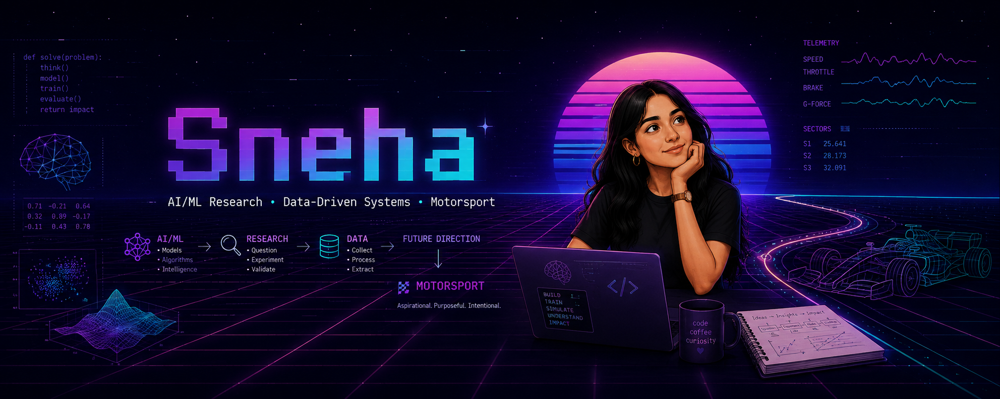
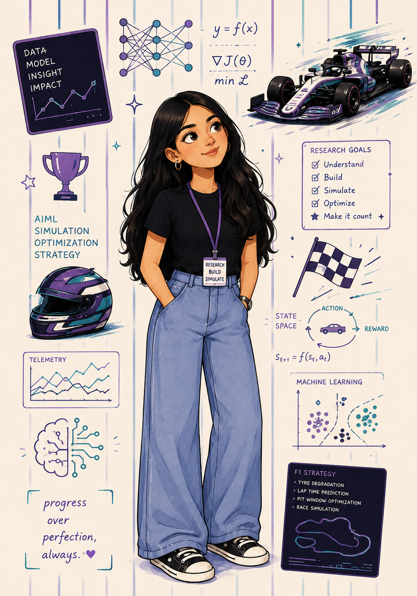

<!--
  SNEHA — GitHub Profile README
  Palette: Midnight #0F172A · Purple #6F4DAB · Blue #4C6EF5 · Aqua #22D3EE · Teal #138A8E
  Repository: Sneha73685/Sneha73685
-->

  

<!-- ═══════════════════════════════════════════════════════════════════════ -->
<!-- INTRODUCTION -->
<!-- ═══════════════════════════════════════════════════════════════════════ -->

<h1 align="center">Hey there, I'm Sneha</h1>

  

  

<a href="#about-me">About</a>
&nbsp;&nbsp;•&nbsp;&nbsp;
<a href="#tech-stack">Tech Stack</a>
&nbsp;&nbsp;•&nbsp;&nbsp;
<a href="#selected-work">Selected Work</a>
&nbsp;&nbsp;•&nbsp;&nbsp;
<a href="#github-analytics">GitHub Analytics</a>
&nbsp;&nbsp;•&nbsp;&nbsp;
<a href="#connect">Connect</a>

 

---

<!-- ═══════════════════════════════════════════════════════════════════════ -->
<!-- ABOUT -->
<!-- ═══════════════════════════════════════════════════════════════════════ -->

<h2 id="about-me" align="center">About Me</h2>

<table align="center">
<tr>
<td width="65%" valign="top">

I'm an engineering student working across **AI/ML, applied research, and data-driven systems** — building software that turns raw, often messy data into something a system, or a person, can act on.

Most of what I build sits at the intersection of research and engineering: designing models, building the pipelines that feed them, and shipping the interfaces that make the output usable. Recent work spans computer vision, NLP, and full-stack data platforms.

I'm increasingly drawn to **motorsport as an application domain**. Race telemetry, tyre degradation modeling, and strategy simulation are, at their core, the same class of problem I already work on — extracting signal from high-frequency, high-stakes data. It's a direction I'm building toward, not a role I hold today.

 

**Currently focused on →** applied ML research · data pipelines · systems engineering

**Building toward →** applying AI and data systems to motorsport analytics

</td>

<td width="35%" align="center" valign="middle">

  

</td>
</tr>
</table>

 

---

<!-- ═══════════════════════════════════════════════════════════════════════ -->
<!-- TECH STACK -->
<!-- ═══════════════════════════════════════════════════════════════════════ -->

<h2 id="tech-stack" align="center">Tech Stack</h2>

### Languages

  

### AI / ML & Data

  

### Web & Infrastructure

  

`FastF1` &nbsp; `YOLOv8` &nbsp; `Bhashini` &nbsp; `SDR`

 

---

<!-- ═══════════════════════════════════════════════════════════════════════ -->
<!-- SELECTED WORK -->
<!-- ═══════════════════════════════════════════════════════════════════════ -->

<h2 id="selected-work" align="center">Selected Work</h2>

<table align="center" width="100%">
<tr><td>

**[Sentiment Analysis](https://github.com/Sneha73685/sentiment-analysis)**
Responsible mental-health NLP pipeline with sentiment analysis, depression-risk inference, trajectory analysis, and uncertainty-aware simulation.
`Python`

</td></tr>
<tr><td>

**[PitWall](https://github.com/Sneha73685/pitwall)**
Open-source F1 race engineering platform for telemetry analysis, lap comparison, session analytics, and tyre strategy insights.
`Python`

</td></tr>
<tr><td>

**[CaseSync](https://github.com/Sneha73685/casesync)**
AI-powered FIR documentation assistant for law enforcement, with speech-to-text transcription, multilingual (Bhashini) support, and entity extraction for structured case drafting.
`Python` `FastAPI` `PostgreSQL`

</td></tr>
<tr><td>

**[DomeWatch](https://github.com/Sneha73685/Domewatch)**
AI-powered anti-drone security system that detects, classifies, and tracks unauthorized drones using computer vision for real-time airspace protection.
`TypeScript` `Computer Vision`

</td></tr>
<tr><td>

**[Aether](https://github.com/Sneha73685/aether)**
Browser-native, GPU-accelerated particle and simulation engine driven by real-time webcam hand tracking — no controllers, no markers.
`TypeScript`

</td></tr>
<tr><td>

**[Veyra](https://github.com/Sneha73685/veyra)**
Evidence-grounded AI mock interview platform that tailors interviews to a candidate's resume and target job description, with structured, explainable feedback.
`Python`

</td></tr>
<tr><td>

**[Punah-Pustak](https://github.com/Sneha73685/Punah-Pustak)**
Full-stack second-hand book marketplace connecting buyers and sellers, with secure authentication, listings, search, and user profiles.
`React` `FastAPI` `PostgreSQL`

</td></tr>
</table>

 

---

<!-- ═══════════════════════════════════════════════════════════════════════ -->
<!-- GITHUB ANALYTICS -->
<!-- ═══════════════════════════════════════════════════════════════════════ -->

<h2 id="github-analytics" align="center">GitHub Analytics</h2>

  

  

 

---

<!-- ═══════════════════════════════════════════════════════════════════════ -->
<!-- CONTRIBUTION SNAKE -->
<!-- ═══════════════════════════════════════════════════════════════════════ -->

<h2 align="center">Contribution Snake</h2>

<!-- Generated by .github/workflows/snake.yml, published to the "output" branch -->
<picture>
  <source media="(prefers-color-scheme: dark)" srcset="https://raw.githubusercontent.com/Sneha73685/Sneha73685/output/github-contribution-grid-snake-dark.svg">
  <source media="(prefers-color-scheme: light)" srcset="https://raw.githubusercontent.com/Sneha73685/Sneha73685/output/github-contribution-grid-snake.svg">
  
</picture>

 

---

<!-- ═══════════════════════════════════════════════════════════════════════ -->
<!-- CONNECT -->
<!-- ═══════════════════════════════════════════════════════════════════════ -->

<h2 id="connect" align="center">Let's Connect</h2>

  

 

---

<!-- ═══════════════════════════════════════════════════════════════════════ -->
<!-- CLOSING -->
<!-- ═══════════════════════════════════════════════════════════════════════ -->

Researching · building · iterating — toward AI-driven systems for motorsport.

  

